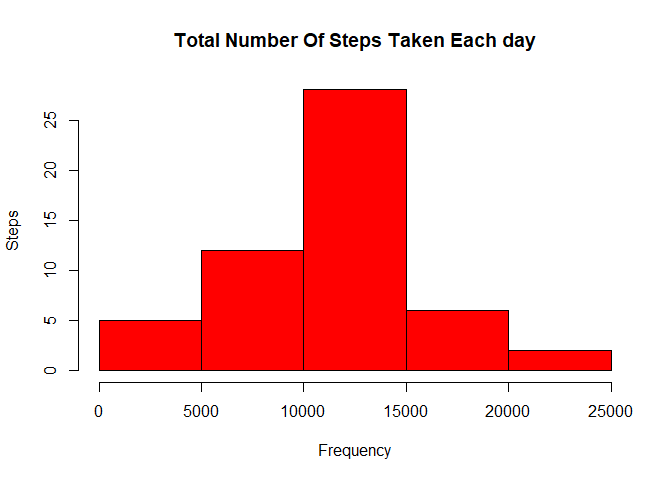
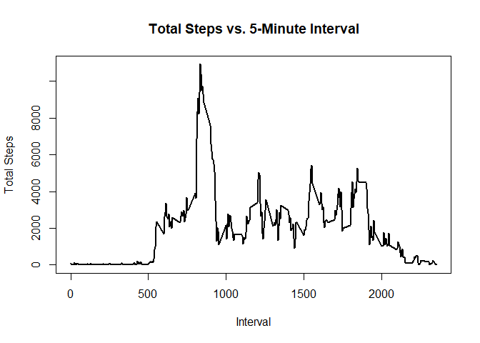
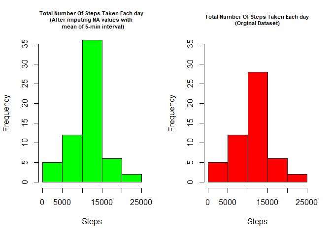
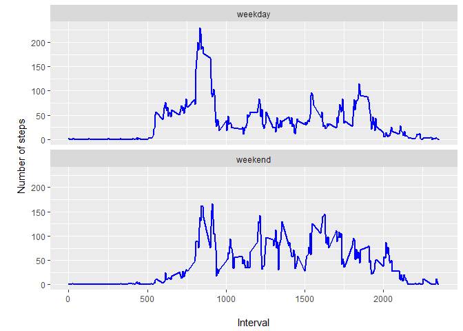

---

Brief Overview of Data
The data for this assignment can be downloaded from the course web site:

Dataset: Activity monitoring data
The variables included in this dataset are:

steps: Number of steps taking in a 5-minute interval (missing values are coded as NA)

date: The date on which the measurement was taken in YYYY-MM-DD format

interval: Identifier for the 5-minute interval in which measurement was taken
-----------------


## Loading and preprocessing the data


```
## 
## Attaching package: 'dplyr'
```

```
## The following objects are masked from 'package:stats':
## 
##     filter, lag
```

```
## The following objects are masked from 'package:base':
## 
##     intersect, setdiff, setequal, union
```

Unzip data to Obtain csv file


Reading the data into activuity data frame and show some summary statistics


```
## 'data.frame':	17568 obs. of  3 variables:
##  $ steps   : int  NA NA NA NA NA NA NA NA NA NA ...
##  $ date    : Factor w/ 61 levels "2012-10-01","2012-10-02",..: 1 1 1 1 1 1 1 1 1 1 ...
##  $ interval: int  0 5 10 15 20 25 30 35 40 45 ...
```

```
##      steps                date          interval     
##  Min.   :  0.00   2012-10-01:  288   Min.   :   0.0  
##  1st Qu.:  0.00   2012-10-02:  288   1st Qu.: 588.8  
##  Median :  0.00   2012-10-03:  288   Median :1177.5  
##  Mean   : 37.38   2012-10-04:  288   Mean   :1177.5  
##  3rd Qu.: 12.00   2012-10-05:  288   3rd Qu.:1766.2  
##  Max.   :806.00   2012-10-06:  288   Max.   :2355.0  
##  NA's   :2304     (Other)   :15840
```

## Process/transform the data (if necessary) into a format suitable for your analysis

```
##   steps       date interval
## 1    NA 2012-10-01        0
## 2    NA 2012-10-01        5
## 3    NA 2012-10-01       10
## 4    NA 2012-10-01       15
## 5    NA 2012-10-01       20
## 6    NA 2012-10-01       25
```

## What is mean total number of steps taken per day?
1. Calculate the number of steps taken per day (Ignore the missin values)

```
##         date steps
## 1 2012-10-02   126
## 2 2012-10-03 11352
## 3 2012-10-04 12116
## 4 2012-10-05 13294
## 5 2012-10-06 15420
## 6 2012-10-07 11015
```
2. Histogram of the total number of steps taken each day
<!-- -->

 3.Calculate and report the mean and median total number of steps taken per day
 

```
## [1] 10766.19
```

```
## [1] 10765
```
 

## What is the average daily activity pattern?
1. Make a time series plot (i.e. type = "l") of the 5-minute interval (x-axis) and the average number of steps taken, averaged across all days (y-axis)

<!-- -->

2. Which 5-minute interval, on average across all the days in the dataset, contains the maximum number of steps?


```
##   interval steps
## 1      835 10927
```


## Imputing missing values
1. Calculate and report the total number of missing values in the dataset (i.e. the total number of rows with NAs)


```
## 
## FALSE  TRUE 
## 50400  2304
```

2.Devise a strategy for filling in all of the missing values in the dataset. Create a new dataset that is equal to the original dataset but with the missing data filled in. I will use the mean for that 5-minute interval.


```
##   interval steps.x       date  steps.y    steps
## 1        0      NA 2012-10-01 1.716981 1.716981
## 2        0       0 2012-11-23 1.716981 0.000000
## 3        0       0 2012-10-28 1.716981 0.000000
## 4        0       0 2012-11-06 1.716981 0.000000
## 5        0       0 2012-11-24 1.716981 0.000000
## 6        0       0 2012-11-15 1.716981 0.000000
```

3.Create a new dataset that is equal to the original dataset but with the missing data filled in.


```
##      steps       date interval
## 1 1.716981 2012-10-01        0
## 2 0.000000 2012-11-23        0
## 3 0.000000 2012-10-28        0
## 4 0.000000 2012-11-06        0
## 5 0.000000 2012-11-24        0
## 6 0.000000 2012-11-15        0
```
# Histogram of the total number of steps taken each day
<!-- -->

Mean and median number of steps taken each day


```
## [1] "New Mean      : 10766.19 ,  Original Mean : 10766.19 ,  Difference : 0"
```

```
## [1] "New Median    : 10766.1886792453 ,  Original Median : 10765 ,  Difference : 1.19"
```


## Are there differences in activity patterns between weekdays and weekends?

For this part the weekdays() function may be of some help here. Use the dataset with the filled-in missing values for this part.

1.Create a new factor variable in the dataset with two levels - "weekday" and "weekend" indicating whether a given date is a weekday or weekend day.


```
## 
## FALSE  TRUE 
## 12960  4608
```

```
## 
## weekday weekend 
##   12960    4608
```

```
##      steps       date interval dayofweek
## 1 1.716981 2012-10-01        0   weekday
## 2 0.000000 2012-11-23        0   weekday
## 3 0.000000 2012-10-28        0   weekend
## 4 0.000000 2012-11-06        0   weekday
## 5 0.000000 2012-11-24        0   weekend
## 6 0.000000 2012-11-15        0   weekday
```


2.Make a panel plot containing a time series plot (i.e. type = "l") of the 5-minute interval (x-axis) and the average number of steps taken, averaged across all weekday days or weekend days (y-axis)


```r
#Aggregating(mean) steps over interval and day of week
meaninterval_new<- aggregate(steps ~ interval + dayofweek, anew, FUN=mean)

#Aggregated Data
head(meaninterval_new)
```

```
##   interval dayofweek      steps
## 1        0   weekday 2.25115304
## 2        5   weekday 0.44528302
## 3       10   weekday 0.17316562
## 4       15   weekday 0.19790356
## 5       20   weekday 0.09895178
## 6       25   weekday 1.59035639
```

```r
#Time Series plot using ggplot
ggplot(meaninterval_new, aes(x=interval, y=steps)) + 
  geom_line(color="blue", size=1) + 
  facet_wrap(~dayofweek, nrow=2) +
  labs(x="\nInterval", y="\nNumber of steps")
```

<!-- -->
